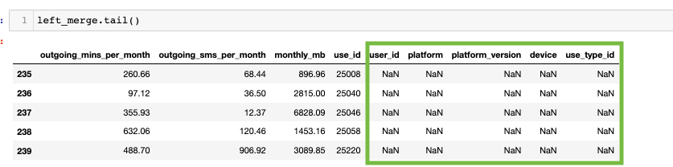

# Merging-With-Pandas

**Practicing different Merging Techniques in Pandas**

## Overview

**Learning how to merge multiple data frames together is an essentail skill to have in the data programming world.** 

## Results 

### Left_merge

**Using the left_merge in the data frames "user_usage" and "user-device" we can merge both data frames on the `how="left"` method**

### Right_merge

**Using the left_merge in the data frames "user_usage" and "user-device" we can merge both data frames on the `how="right"` method**

## Difference Between Left_merge and Right_merge

**The difference between the Left_merge and Right_merge data frames is that in the Right_merge method it replaced all the NaN values that were present in the Left_merge method.**

 

## Inner_merge 

**The Inner_merge method is the default method the used in Pandas by default. The Inner_method only keeps the common values in both the left and right dataframes for the merged data. In this case only the rows that contain `use_id` values are the common between `user_usage` and `user_device` remain in the merged data.

